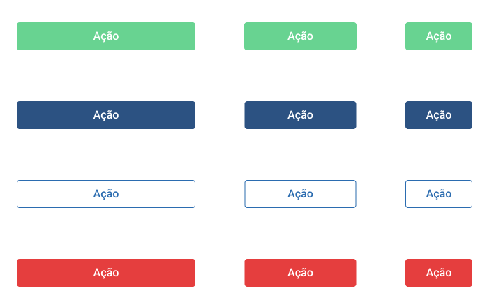

# Botões

## Tipos



De cima para baixo:

* Botões Primários
* Botões Secundários
* Botões Terciários
* Botões de Erro/Cancelamento

Da esquerda para a direita:

* Botões grandes
* Botões médios
* Botões pequenos

## Uso

### Por tipo

* **Botões Primários:** utilizados para a função principal da tela em que se encontra. **Só deve existir um botão primário na tela.**

  Exemplo: nas telas de formulário, o botão primário dever indicar a ação que envia aquele formulário que é, por sua vez, a principal função da tela.

* **Botões Secundários:** utilizados para a segunda função mais importante na tela. Podem existir mais de um.
* **Botões Terciários:** usado para guiar o usuário para outra tela, sendo essa mudança nova um desvio do fluxo seguido até então.

  Exemplo: o botão que guia o usuário para a tela de cadastro caso ele ainda não tenha uma conta e esteja na tela de Login.

* **Botões de Erro e Cancelamento**

  Exemplo: caso o usuário esteja preenchendo um formulário que insere uma despesa e desista do processo, o botão que fechará a sessão de adição deve ser um botão de erro/cancelamento.

### Por tamanho

O tamanho dos botões a serem utilizados pode ser escolhido de acordo com o tamanho do texto que será inserido, por exemplo, "Ok" é uma palavra curta e exige um botão pequeno; "Fazer Login com o Google" é uma frase grande e exige um botão grande.

**Exceção:** quando os botões se encontrarem dentro de um formulário, serão sempre grandes para se alinharem ao tamanho dos inputs de texto.

## Desenvolvimento

### Implementação

As tags de botão, não são &lt;Button&gt; e sim &lt;TouchableOpacity&gt;.

* Importação do componente:

```jsx
import { TouchableOpacity } from "react-native";
```

* Implementação do componente

```jsx
<TouchableOpacity style={estilos.(...)} onPress={funcao}>
    <Text>Ação do Botão</Text>
</TouchableOpacity>
```

### Estilização

Para implementar qualquer um dos botões, copie e cole os códigos a seguir dentro do objeto estilos no topo do arquivo que estiver utilizando.

#### Botões Primários

```jsx
// Estilizando botão primário grande
botaoPrimarioGrande: tailwind("bg-green-400 py-2 rounded w-64"),
textoBotao: tailwind("text-white font-medium text-lg text-center")

// Estilizando botão primário médio
botaoPrimarioMedio: tailwind("bg-green-400 py-2 rounded w-40"),
textoBotao: tailwind("text-white font-medium text-lg text-center")

// Estilizando botão primário pequeno
botaoPrimarioPequeno: tailwind("bg-green-400 py-2 rounded w-24"),
textoBotao: tailwind("text-white font-medium text-lg text-center")
```

#### Botões Secundários

```jsx
// Estilizando botão secundário grande
botaoSecundarioGrande: tailwind("bg-blue-800 py-2 rounded w-64"),
textoBotao: tailwind("text-white font-medium text-lg text-center")

// Estilizando botão secundário médio
botaoSecundarioMedio: tailwind("bg-blue-800 py-2 rounded w-40"),
textoBotao: tailwind("text-white font-medium text-lg text-center")

// Estilizando botão secundário pequeno
botaoSecundarioPequeno: tailwind("bg-blue-800 py-2 rounded w-24"),
textoBotao: tailwind("text-white font-medium text-lg text-center")
```

#### Botões Terciários

* Botões terciários não possuem bordas, no entanto, possuem variação de tamanho também. Para escolher o tamanho certo é só levar em consideração o tamanho do texto no botão.
* Botões terciários são os únicos com texto diferente, os códigos para estilização de texto em botões primários e secundários é igual, **mas do terciário não**.

```jsx
// Estilizando botão terciario grande
botaoTerciarioGrande: tailwind("bg-transparent py-2 rounded w-64"),
textoBotaoTerciario: tailwind("text-blue-700 font-medium text-lg text-center"),

// Estilizando botão terciário médio
botaoTerciarioMedio: tailwind("bg-transparent py-2 rounded w-40"),
textoBotaoTerciario: tailwind("text-blue-700 font-medium text-lg text-center"),

// Estilizando botão terciário pequeno
botaoTerciarioPequeno: tailwind("bg-transparent py-2 rounded w-24"),
textoBotaoTerciario: tailwind("text-blue-700 font-medium text-lg text-center"),
```

#### Botões de Erro

```jsx
// Estilizando botão de erro grande
botaoPrimarioGrande: tailwind("bg-red-600 py-2 rounded w-64"),
textoBotao: tailwind("text-white font-medium text-lg text-center")

// Estilizando botão de erro médio
botaoPrimarioMedio: tailwind("bg-red-600 py-2 rounded w-40"),
textoBotao: tailwind("text-white font-medium text-lg text-center")

// Estilizando botão de erro pequeno
botaoPrimarioPequeno: tailwind("bg-red-600 py-2 rounded w-24"),
textoBotao: tailwind("text-white font-medium text-lg text-center")
```


#### Por que não &lt;button&gt;?

Porque a tag de botões provida pelo React Native tem uma estilização própria, muito específica para ser sobrescrita.

Além disso, &lt;TouchableOpacity&gt; o comportamento de opacidade ao clicar que vai nos poupar de ter que aplicar "hover" e "click" nos botões - o que o wrapper de Tailwind para React Native não suporta ainda e teria que ser feito com código externo.

