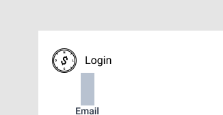

# Indicador de Localização



#### 

#### Objetivo

Manter o usuário ciente de que ação está realizando no aplicativo no momento.

### Implementação

```javascript
<View accessibilityRole="header" style={[estilos.componenteLocalizacao]}>
			<Image style={estilos.logoLocalizacao} source={require("../assets/monologo512x512.png")}/>
			<Text style={estilos.textoLocalizacao}>Fazer Login</Text>
</View>
```

### Estilização

```javascript
componenteLocalizacao: tailwind("w-full flex flex-row items-center pt-5 pl-5"),
logoLocalizacao: tailwind("mr-3 w-8 h-8"),
textoLocalizacao: tailwind("text-base"),
```

#### Observação:

Se a barra de status/notificação do telefone estiver sobrepondo o componente de localização, a altura da página não está levando em consideração a altura da barra. Consulte a página sobre statusBar.

