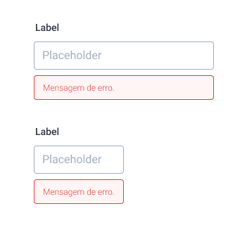
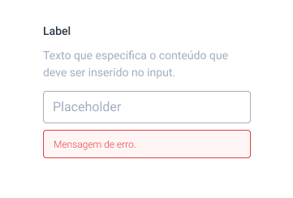

# Input

Inputs são unidades de entrada de texto, a documentação para um formulário \(padrão formado por componentes funcionais e validável\) se encontra \(aqui\)\[Se não tem um link é porque eu ainda não escrevi hehe\]

#### Tipos de Input

* Inputs de texto: fornecidos como componentes nativos do React Native e mais frequentemente utilizados.
* Inputs de texto com dica
* Checkboxes: _a implementar._
* Input de data: _a decidir._

## Input de Texto



### Anatomia

Os inputs de texto são compostos por:

* Um container \(View\)
* Um label \(Text\) 
* O input \(TextInput\)
* Texto de erro \(Text\)
  * Encapsulado por um objeto de validação do Formik

### Implementação

```javascript
<View style={[estilos.containerInput]}>
		<Text style={estilos.labelInput}>Conteúdo do Input</Text>
				<TextInput 
					style={estilos.input} 
					// ... props do Formik
					blurOnSubmit={true}
					keyboard={} //tipo de teclado a ser utilizado
					placeholder={} //texto no interior do input
					placeholderTextColor={"#A0AEC0"}/>

					{errors./*inputName*/ && (
						<Text style={estilos.errorInput}>
										{errors./*inputName*/}
						</Text>
					)}
</View>
```

### Estilização

```javascript
containerInput: tailwind("w-64 mb-2"),
labelInput: tailwind("text-gray-700 text-base font-bold mb-3"),
input: tailwind("border border-gray-500 rounded w-full py-2 px-3 text-gray-700 text-base"),
errorInput: tailwind("bg-red-100 border border-red-400 text-red-700 px-4 py-2 mt-2 rounded relative"),
```

O que determina o tamanho de todos os elementos do input: label, mensagem de erro e o próprio &lt;TextInput&gt; é o tamanho do container de Input. Por isso, a única diferença de código entre o Input Grande e o Input Pequeno é a linha:

```javascript
containerInputPequeno: tailwind("w-32 mb-2"),
```

## Input de Texto com Dica



### Anatomia

* Um container \(`View`\)
  * Um label \(`Text`\) 
  * Um texto explicativo \(`Text`\)
  * O input \(`TextInput`\)
  * Texto de erro \(`Text`\)
    * Encapsulado por um objeto de validação do Formik

### Implementação

### Estilização


> Inputs com Dica só devem ser utilizados no tamanho grande. Colocar dicas em um input de tamanho pequeno, compromete a visibilidade e a estrutura do formulário.

