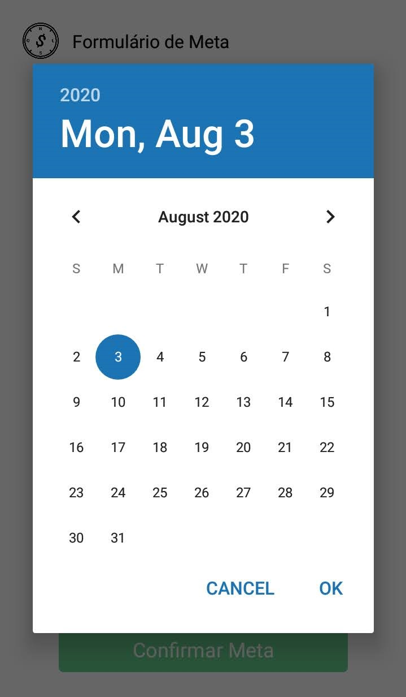

# Input

Inputs são unidades de entrada de texto, a documentação para um formulário \(padrão formado por componentes funcionais e validável\) se encontra \(aqui\)\[Se não tem um link é porque eu ainda não escrevi hehe\]

### Tipos de Inputs

* Inputs de texto
* Inputs de texto com dica
* Select
* Inputs de data
* Checkboxes: _a implementar._

## Input de Texto


### Anatomia

Os inputs de texto são compostos por:

* Um container \(View\)
* Um label \(Text\) 
* O input \(TextInput\)
* Texto de erro \(Text\)
  * Encapsulado por um objeto de validação do Formik

### Implementação

```javascript
<View style={[estilos.containerInput]}>
		<Text style={estilos.labelInput}>Conteúdo do Input</Text>
				<TextInput 
					style={estilos.input} 
					// ... props do Formik
					blurOnSubmit={true}
					keyboard={} //tipo de teclado a ser utilizado
					placeholder={} //texto no interior do input
					placeholderTextColor={"#A0AEC0"}/>

					{errors./*inputName*/ && (
						<Text style={estilos.errorInput}>
										{errors./*inputName*/}
						</Text>
					)}
</View>
```

### Estilização

```javascript
containerInput: tailwind("w-64 mb-2"),
labelInput: tailwind("text-gray-700 text-base font-bold mb-3"),
input: tailwind("border border-gray-500 rounded w-full py-2 px-3 text-gray-700 text-base"),
errorInput: tailwind("bg-red-100 border border-red-400 text-red-700 px-4 py-2 mt-2 rounded relative"),
```

O que determina o tamanho de todos os elementos do input: label, mensagem de erro e o próprio &lt;TextInput&gt; é o tamanho do container de Input. Por isso, a única diferença de código entre o Input Grande e o Input Pequeno é a linha:

```javascript
containerInputPequeno: tailwind("w-32 mb-2"),
```

## Input de Texto com Dica


### Anatomia

* Um container \(`View`\)
  * Um label \(`Text`\) 
  * Um texto explicativo \(`Text`\)
  * O input \(`TextInput`\)
  * Texto de erro \(`Text`\)
    * Encapsulado por um objeto de validação do Formik

### Implementação

```javascript
<View style={[estilos.containerInput]}>
		<Text style={estilos.labelInput}>Conteúdo do Input</Text>
		<Text style={estilos.textoDica}>/*Dica*/</Text>
				<TextInput 
					style={estilos.input} 
					// ... props do Formik
					blurOnSubmit={true}
					keyboard={} //tipo de teclado a ser utilizado
					placeholder={} //texto no interior do input
					placeholderTextColor={"#A0AEC0"}/>

					{errors./*inputName*/ && (
						<Text style={estilos.errorInput}>
										{errors./*inputName*/}
						</Text>
					)}
</View>
```

### Estilização

```javascript
containerFormulario: tailwind("w-full items-center"),
containerInput: tailwind("w-64 mb-2"),
labelInput: tailwind("text-gray-700 text-base font-bold mb-3"),
textoDica: tailwind("text-gray-500 text-base mb-3"),
input: tailwind( "border border-gray-500 rounded w-full py-2 px-3 text-gray-700 text-base"),
errorInput: tailwind("bg-red-100 border border-red-400 text-red-700 px-4 py-2 mt-2 rounded relative"),
```

A única linha de diferença para um input de texto comum é a adição de `textoDica`.

```javascript
textoDica: tailwind("text-gray-500 text-base")
```

> Inputs com Dica só devem ser utilizados no tamanho grande. Colocar dicas em um input de tamanho pequeno, compromete a visibilidade e a estrutura do formulário.

## Input de Data




Os inputs de data são fornecidos pela comunidade do React Native, não sendo parte integral da framework em si ou da framework Formik, utilizada para gerenciar os formulários.

### Anatomia

* Um container \(`TouchableOpacity`\)
  * Um label \(`Text`\) 
  * Um texto explicativo \(`Text`\)
  * O input \(`TextInput`\)
  * Texto de erro \(`Text`\)
    * Encapsulado por um objeto de validação do Formik

Para minimizar as diferenças de implementação de, a aparência do input de data é exatamente a mesma do input de texto. A maior diferença é que o container do Input passa a ser um componente clicável, `<TouchableOpacity/>` , uma vez que:

* Não é possível realizar a abertura do componente de data através de um clique no input de texto visível.
* O feedback visual de clique quando o evento é acionado por clique no Label é ruim.
* O feedback visual de clique em todos os sub-componentes do input pareceu mais agradável.

### Implementação

#### Importações

```javascript
import React, {useState} from "React";
import DateTimePicker from "@react-native-community/datetimepicker";
```

1. Adicione o hook `useState`, ele será utilizado para controlar a visibilidade do input de data.
2. Importe o componente `DateTimePicker`

#### Hooks

```javascript
export default function /*Tela*/() {
	const [date, setDate] = useState(new Date());
	const [mode, setMode] = useState("date");
	const [show, setShow] = useState(false);

	const showDatePicker = () => {
		setShow(true);
		setMode("date");
	};
	
	return ( 
	 //
	)
}
```

#### Integração com Formik

Para que ocorra a passagem de dados para o Formik é necessária a utilização do método `setFieldValues`. Tenha certeza que ele está sendo desconstruído junto com os demais métodos na instância do formulário.

```javascript
<View style={estilos.containerFormulario}>
					<Formik // ...>
						{({ //handleChange,handleBlur,handleSubmit, values, errors,
							setFieldValue,
						}) => ( 
							// Renderização dos componentes
						)
<View/>
```

#### Componentes

```javascript
<TouchableOpacity style={[estilos.containerInput]}
									onPress={showDatePicker}>
		<Text style={estilos.labelInput}>Prazo</Text>
		<TextInput style={estilos.input} editable={false} value={values.prazo} placeholder={"Selecione a data."} placeholderTextColor={"#A0AEC0"}/>
				{show && (
					<DateTimePicker value={date} mode={mode} display="default" onChange={(event, selectedDate) => { 
						setShow(false);
						const currentDate = selectedDate.toString();
						setFieldValue("prazo", currentDate);
						console.log(currentDate);
				 	}}/>
				)}
				{errors.prazo && (
					<Text style={estilos.errorInput}>
							{errors.prazo}
					</Text>
				)}
/TouchableOpacity>
```

* O input de texto nesse caso recebe a propriedade `editable` como `false`, para impedir que o usuário interaja com ele de outra maneira além da desejada.
* Ele então recebe o valor selecionado pelo usuário através do método Formik `SetFieldValues`

### Estilização

Exatamente as mesmas de um input de texto comum, favor checar acima.


