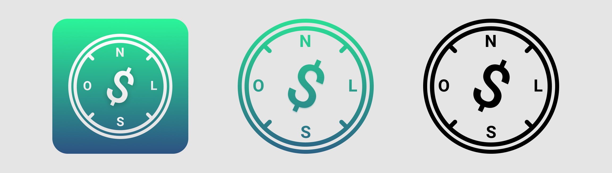

# Logo

### Variações de Logo

### Quando utilizar cada Logo

#### Logo Primária

* Ícone do .pkg do aplicativo.
* Ícone do aplicativo na Play Store \(o aplicativo vai pra Play Store?\)
* Imagem utilizada na Tela Inicial

#### Logo Secundária

* Utilizada nas notificações do aplicativo \(o aplicativo terá notificações?\)

#### Logo Monocromática

* Utilizada nas páginas internas do aplicativo, frequentemente no componente de localização interna para o usuário. 
  * Para diretrizes de espaçamento em relação ao texto, favor checar o componente de localização interna.

Essa logo é monocromática especialmente para não captar a atenção do usuário em relação ao que está acontecendo na tela; e preta para criar contraste com o fundo branco, suficientemente legível mesmo em casos de disparidade visual.

### Tamanhos

Todas as logos estão disponíveis no arquivo Figma, na página de Assets, nas seguintes resoluções:

* 512x512
* 182x192
* 144x144
* 96x96
* 88x88
* 72x72
* 64x64
* 48x48
* 36x36

Nem todos os tamanhos são utilizados atualmente. Seguem os valores em uso para as respectivas imagens:

* Logo Primária
  * Na tela inicial do aplicativo, utilizada em 144x144
* Logo Secundária
  * \[Previsão\] Em notificações: 24x24, 36x36, 48x48, 72x72, 96x96 \(para ícones pequenos\) e 256x256 para ícones grandes de notificação.\*
* Logo Monocromática
  * Em componentes de localização interna, utilizada em 36x36.

## Desenvolvimento

Caso necessite de uma logo em tamanho não encontrado na pasta de `assets`da Branch operada, mas que esteja listado como utilizado aqui, faça a exportação da imagem pelo Figma.

* A imagem deve ser exportada em .**png**
* A imagem deve ser colocada na pasta de **`assets`**
* O nome da imagem deve ser composto, nessa ordem, por:

  > nomedalogo + tamanhoempixels
  >
  > Por exemplo: logosecundaria64x64.png

## Fontes

* [Página com recursos utilizados em notificações de aplicativos nativos do android.](https://documentation.onesignal.com/docs/customize-notification-icons)

